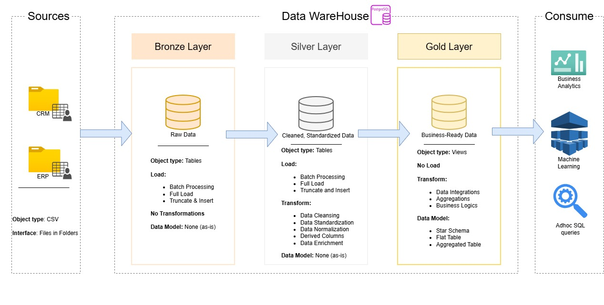

# Data Warehouse and Analytics Project

Welcome to the Data Warehouse and Analytics Project repository!
This project demonstrates a multi-layered Data Warehouse architecture using the Bronze-Silver-Gold design pattern. The architecture helps manage data ingestion, transformation, and consumption efficiently for analytics, machine learning, and reporting.

## 📁 Overview
The workflow follows a layered approach to data processing:
* **Sources** – Data originates from CRM, ERP, and other CSV-based systems.
* **Bronze Layer** – Stores raw data without transformations.
* **Silver Layer** – Contains cleaned and standardized data.
* **Gold Layer** – Holds business-ready, aggregated data views.
* **Consumption Layer** – Enables business analytics, machine learning models, and ad-hoc analysis.

## 🧱 Architecture Layers
* **Bronze Layer – Raw Data**
  * **Object Type:** Tables
  * **Load Type:** Batch Processing, Full Load, Truncate & Insert
  * **Transformations:** None (raw data, as-is)
  * **Purpose:** Data ingestion and archival; maintain data integrity from source systems.  

* **Silver Layer – Cleaned Data**
  * **Object Type:** Tables
  * **Load Type:** Batch Processing, Full Load, Truncate & Insert
  * **Transformations:**
    * Data cleansing and formatting
    * Standardization and normalization
    * Derived column creation
    * Enrichment with reference data
  * **Purpose:** Prepare consistent, reliable data for downstream models.  

* **Gold Layer – Business-Ready Data**
  * **Object Type:** Views
  * **Transformations:**
    * Data integration and aggregation
    * Calculation of KPIs and metrics
    * Business rules and logic application
  * **Data Model:**
    * Star Schema
    * Flat Tables
    * Aggregated Tables
  * **Purpose:** Provide curated data for analytics and machine learning.
 
## ⚙️ Data Sources
* **CRM System:** Exports customer, interaction, and sales data as CSV.
* **ERP System:** Provides financial, operations, and inventory data.
* **Interface:** Files delivered to designated folders for ingestion.

## 💡 Consumption and Use Cases
* **Business Analytics:** Power BI, Tableau, or Looker dashboards.
* **Machine Learning:** Training datasets for predictive models.
* **Ad Hoc SQL Queries:** For exploration and quick insights.

## 🚀 Future Enhancements
* Implement incremental loads and change data capture (CDC).
